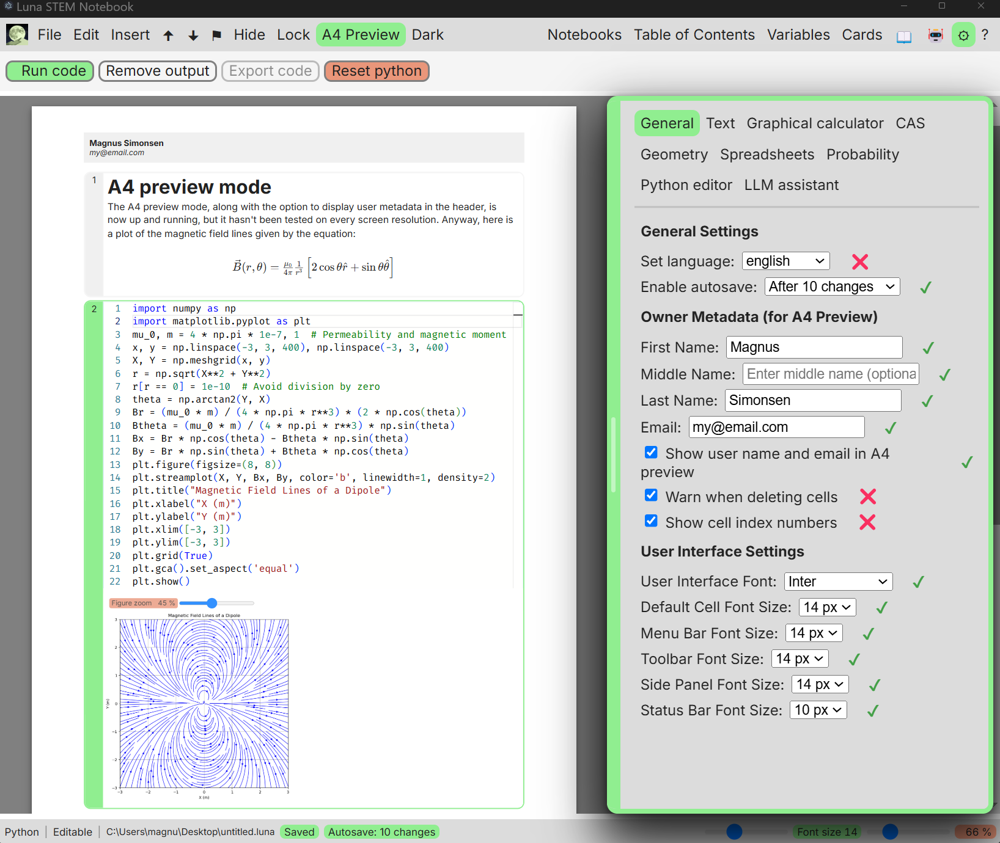
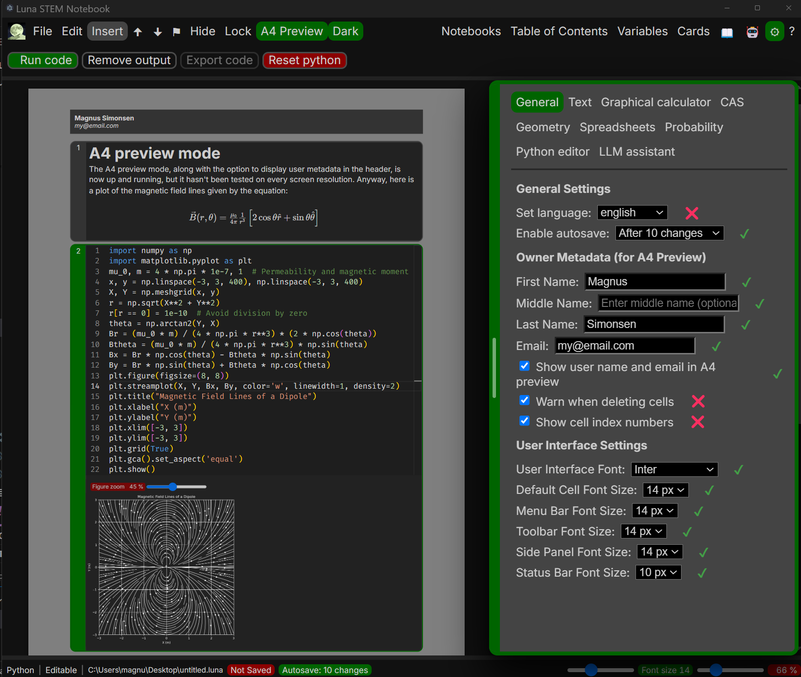
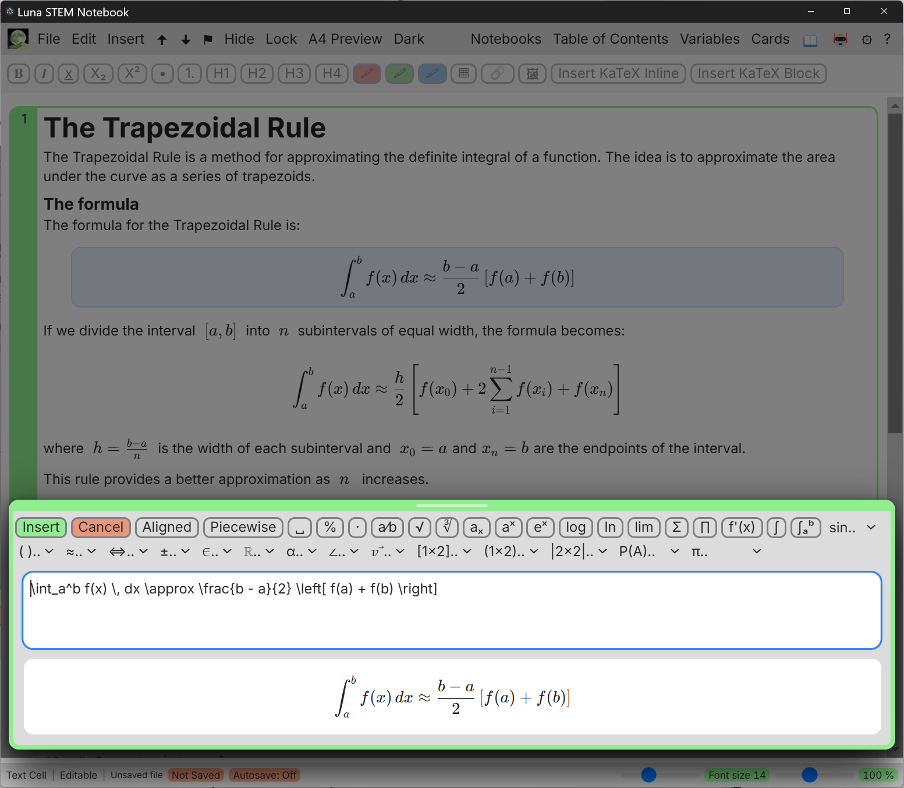
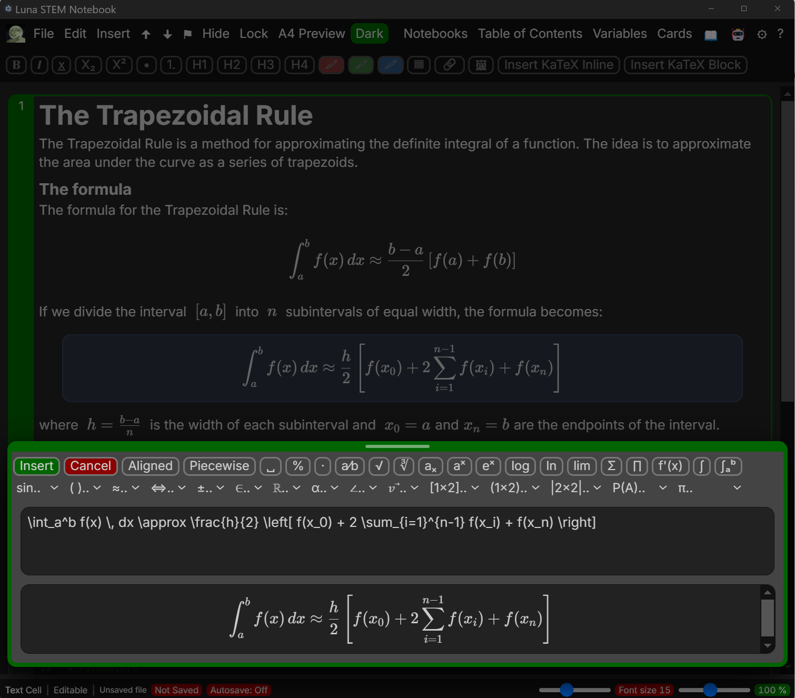
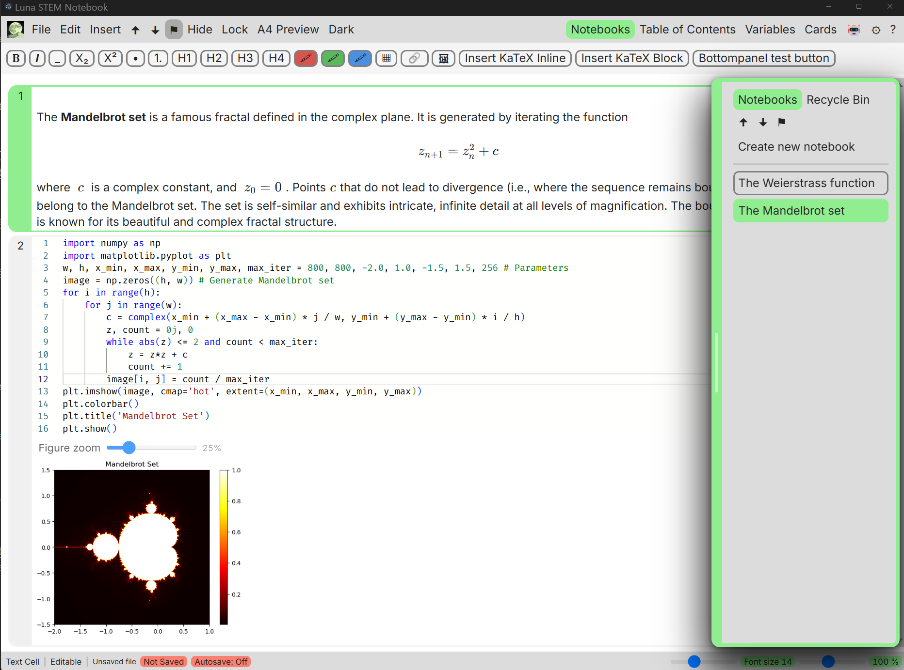

# Download of first release is now available 🎉🥳✨

The first prototype build is now available for download. This early version includes only text editor and Python cells functionality and is only intended to get feedback on bugs and usability issues. Please note: this build may be unstable, and the .luna5 file format is subject to change in future releases.

[**Download the latest release here**](https://github.com/magnussimonsen/Luna5/releases)

   

   

   

   

   

# Luna 0.5

📋 **Contributors:** Please review [src/README-BEST-PRACTICE.md](src/README-BEST-PRACTICE.md) for coding guidelines and project structure.

Built with **Electron**, **Vite**, **Vue 3**, **Pinia**, **TypeScript**, and other open-source modules.

## 🙏 Acknowledgments

Special thanks to the [electron-vite](https://electron-vite.org/guide/) team for their excellent starter tool, `npm create @quick-start/electron@latest`, which helped launch this project.

Thanks also to the [Pyodide](https://pyodide.org/) community for enabling Python in the browser. Luna 0.5 includes Pyodide assets under `public/pyodide` and complies with MPL-2.0 licensing.

## 📚 What is Luna?

**Luna 0.5** is an educational notebook application designed to streamline digital workflows for students and teachers. It integrates essential STEM tools into a unified, document-based interface, reducing the need to switch between multiple programs.

Modern classrooms rely on various disconnected tools (Python editors, GeoGebra, Word, Excel), each with unique interfaces and file formats. This fragmentation slows learning and adds complexity. Luna 0.5 addresses this by providing a notebook-centric workflow, unlike tools such as GeoGebra.

Luna 0.5 combines symbolic algebra, geometry, programming, flashcards with spaced repetition, a formula and facts book, and rich text editing with a KaTeX input panel into one intuitive application.

---

## ✨ Key Features

* 📓 Notebook-style, cell-based interface
* 📝 Rich Text with KaTeX mathematics editor
* 🐍 Live Python execution via Pyodide
* ➗ CAS (Computer Algebra System) with custom, student-friendly syntax (powered by SymPy, maybe... TBD)
* 🔒 Hide or lock cells for creating tests with embedded solutions
* 🧠 Sidebar with list of notebooks, table of contents, formula book and flashcards 
* 🖨️ Export notebooks to PDF, including student name and timestamp in the header
* 🗂️ Flashcards with spaced repetition (for language learning)

---

## 🥷 For Teachers

* Create questions and solutions in the same file using **Hide Cell** and **Lock Cell**
* Export test versions with locked questions and hidden answers
* Reuse and adapt notebooks for lessons, homework, tests or presentations
* Demonstrate math, code, and concepts interactively as in GeoGebra, but in a notebook format

---

## 👨‍🎓 For Students

* Use Luna as an all-in-one notebook for notes, Python code, and algebraic or geometric problems
* Explore geometry visually and intuitively
* Focus on learning without navigating complex menus or multiple apps
* Access syntax examples and contextual help via the sidebar
* Easily share or export your work

---

## 🧰 Included Tools

| Tool                         | Status        |
| ---------------------------- | ------------- |
| Notebook UI with reactive Table of Contents | ✅ Implemented |
| Rich Text / Markdown Editor  | ✅ Core WYSIWYG (Tiptap) with Tiptap mathematics extension |
| Python Environment (Pyodide) | ✅ Implemented |
| CAS (Symbolic Math, Luna syntax + SymPy)   | 🚧 Planned     |
| Graphical Calculator         | 🚧 Planned    |
| Geometry Explorer            | 🚧 Planned    |
| Spreadsheet Tool             | 🚧 Planned    |
| Probability Calculator       | 🚧 Planned    |
| Flashcards (Spaced Repetition) | 🚧 Planned  |

---

## 🐍📦 Pyodide Packages in Luna 0.5

Available for import in Python cells. Most work offline if their wheels are in `public/pyodide`.

- Core: numpy, scipy, matplotlib (incl. pylab), pandas, sympy, pillow
- Extras: seaborn, networkx
- Units/uncertainties: pint, uncertainties

Notes:
- Common dependencies (e.g., python-dateutil, six, contourpy, cycler, kiwisolver, fonttools, packaging, pyparsing, pytz, tzdata, mpmath, gmpy2) auto-install as needed.
- If an import fails, add the wheel to `public/pyodide`, click Reset on the Python cell toolbar, then re-run.
- For `uncertainties`, use `uncertainties.umath` functions (e.g., `umath.sin(x)`) for error propagation.

---

## 🔧 Open Source Stack

### Core Libraries & Frameworks

* Electron (Chromium & Node.js)
* Vue 3 (MIT)
* Vite (MIT)
* Pinia (MIT)
* TypeScript (MIT)
* Monaco Editor (MIT)
* Tiptap (MIT)
* Pyodide (MPL-2.0)

### Planned Libraries / Components

* Rich-text editor with future math input (KaTeX/MathLive; current button is a placeholder)
* Markdown editor with KaTeX rendering
* Code editor (Monaco Editor)
* Pyodide integration (background worker)
* Numerical computation library (in-house or vetted JS/TS package)
* Custom tokenizer/parser for Luna CAS syntax (considering Moo + Nearley; powered by SymPy)

---

## 📁 File Format (.luna5)

Luna notebooks use the `.luna5` extension and are registered with the OS for double-click opening.

**Write pipeline:**
1. Serialize notebook JSON (cells, metadata, etc.)
2. Gzip compress
3. Encrypt with AES‑256‑GCM (temporary dev key)
4. Prepend 5‑byte magic/version header: `LUNA1`
5. Base64 encode for storage

**Read pipeline:**
1. Base64 decode
2. Validate header == `LUNA1`
3. Decrypt (AES‑256‑GCM) → gzip buffer
4. Gunzip → notebook JSON

**Design rationale:**
- Custom extension + header prevents OS from treating file as generic zip
- Header supports future version migration (e.g., `LUNA2`)
- Encryption (even with a placeholder key) deters casual inspection and signature-based icon changes

---

## 🅰️ Fonts Used

* **Comic Neue** (SIL Open Font License 1.1)
* **Inter** (v4.1, SIL Open Font License 1.1, bundled locally)
* **Roboto** (Apache License 2.0)
* **OpenDyslexic** (SIL Open Font License 1.1)
* **Fira Code** (SIL Open Font License 1.1)
* **Fira Mono** (SIL Open Font License 1.1)
* **Arimo** (Apache License 2.0)

---

## 📜 License

This project is licensed under the **MIT License**.

Third-party components are licensed separately:
- Pyodide: Mozilla Public License 2.0 (MPL-2.0)  
  [Pyodide License](https://github.com/pyodide/pyodide/blob/main/LICENSE)
- Monaco Editor: MIT License  
  [Monaco Editor License](https://github.com/microsoft/monaco-editor/blob/main/LICENSE)
- Tiptap: MIT License  
  [Tiptap License](https://github.com/ueberdosis/tiptap/blob/main/LICENSE)

See [THIRD_PARTY_NOTICES.md](./THIRD_PARTY_NOTICES.md) for a full list of third-party dependencies and licenses.
