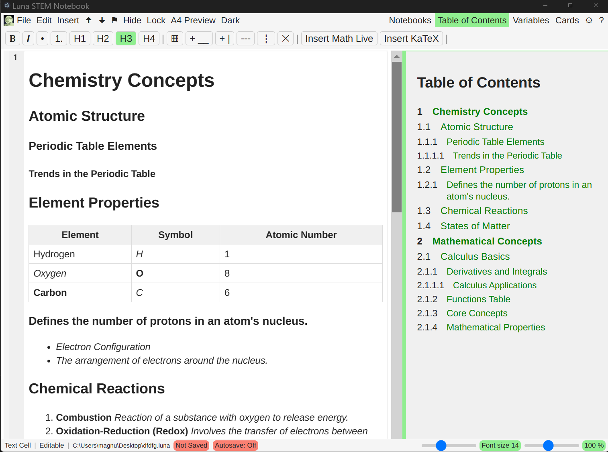
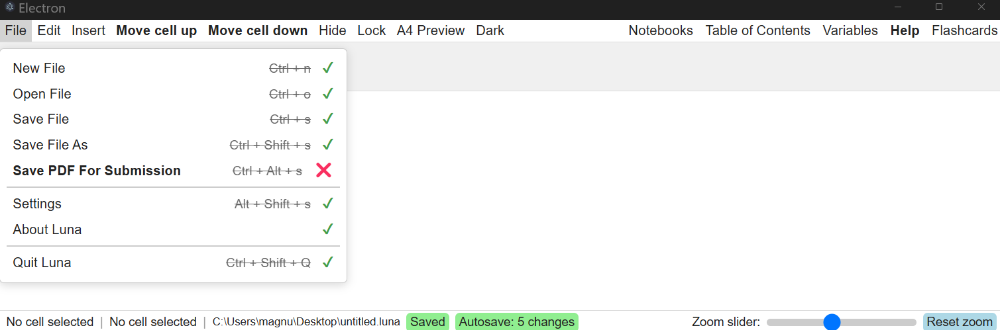
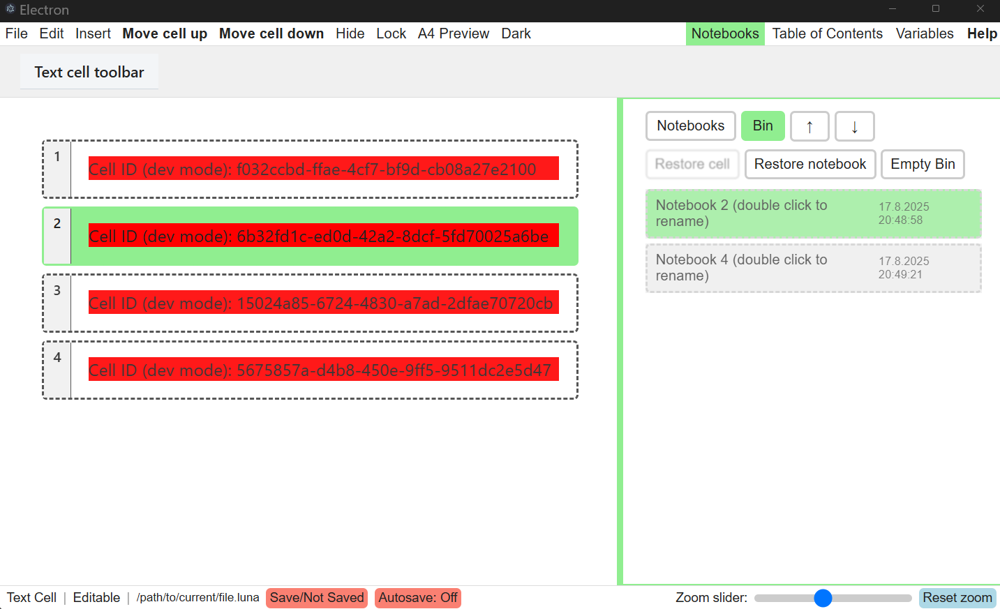

   

# Luna 0.5. 

📋 **For contributors:** Please read [src/README-BEST-PRACTICE.md](src/README-BEST-PRACTICE.md) for coding guidelines and project structure.

Built using **Electron**, **Vite**, **Vue 3**, **Pinia**, and **TypeScript**, along with other open-source modules.

## 🙏 Acknowledgments

Special thanks to the [electron-vite](https://electron-vite.org/guide/) team for creating the excellent `npm create @quick-start/electron@latest` starter tool that jumpstarted this project.

Thanks as well to the [Pyodide](https://pyodide.org/) project and community for making Python run in the browser. Luna 0.5 vendors Pyodide assets under `public/pyodide` and follows its MPL-2.0 licensing.

## 📚 What is Luna?

**Luna 0.5** is an educational notebook-style application designed to simplify and unify digital workflows for both students and teachers. It brings together essential STEM tools in a clean, pedagogically structured interface, eliminating the need to switch between multiple, complex programs.

Modern classrooms often depend on a mix of disconnected tools (Python editors, GeoGebra, Word, Excel) each with its own interface and file formats. This constant "software jumping" slows learning and creates unnecessary friction. While GeoGebra is an excellent tool, it's not built around a document-based notebook workflow. Luna 0.5 is.

Luna 0.5 offers a streamlined alternative, combining symbolic algebra, geometry, programming, and rich text editing all within one intuitive application.

Built-in flashcard functionality supporting text, images, audio, and IPA (International Phonetic Alphabet) input tools are also planned.

---

## ✨ Key Features

* 📓 Notebook-style interface with a linear, cell-based layout
* 📝 Rich Text and Markdown editing support
* 🐍 Live Python execution powered by Pyodide
* ➗ CAS (Computer Algebra System) with a custom, student-friendly syntax (backed by SymPy)
* 🔒 Ability to hide or lock cells, perfect for creating tests with embedded solutions
* 🧠 Sidebar with table of contents and contextual help (syntax tips and examples)
* 🖨️ Export complete notebooks to PDF, automatically including the student's name and the saved date and time in the header. 
* 🗂️ Flashcards with spaced repetition (for use in language learning), add cards with text, images, and audio

---

## 🥷 For Teachers

* Create both questions and solutions in the same file using **Hide Cell** and **Lock Cell**
* Export test versions with questions that are locked and answers hidden; students can write their responses directly in the same file
* Reuse and adapt notebooks for lessons, homework, or live presentations
* Demonstrate math, code, and concepts interactively

---

## 👨‍🎓 For Students

* Use Luna as an all-in-one notebook: take notes, write Python code, and solve algebraic or geometric problems
* Explore geometrical concepts in a natural, visual way
* Focus on learning, not navigating bloated menus or juggling apps
* Get syntax examples and contextual help via the built-in help sidebar
* Share or export your work easily

---

## 🧰 Tools Included

| Tool                         | Status        |
| ---------------------------- | ------------- |
| Notebook UI with automatic, reactive Table of Contents side panel | ✅ Implemented|
| Rich Text / Markdown Editor | ✅ Core WYSIWYG (Tiptap) implemented (basic formatting). Math formula input not yet implemented (placeholder button present) |
| Python Environment (Pyodide)	| ✅ Implemented. Core features available with one Pyodide thread per notebook. Ongoing improvements and testing |
| CAS (Symbolic Math with custom Luna syntax that triggers SymPy for computation)   | 🚧 Planned   |
| Graphical Calculator         | 🚧 Planned    |
| Geometry Explorer            | 🚧 Planned    |
| Spreadsheet Tool             | 🚧 Planned    |
| Probability Calculator       | 🚧 Planned    |
| Flashcards (Spaced Repetition for concept learning) | 🚧 Planned  |

---

##  🐍📦Pyodide packages available in Luna 0.5

These packages can be imported directly in Python cells. Most work fully offline when their wheels are present under `public/pyodide`.

- Core: numpy, scipy, matplotlib (incl. pylab) pandas, sympy, pillow
- Extras: seaborn, networkx
- Units and uncertainties: pint, uncertainties

Notes
- Common dependencies (e.g., python-dateutil, six, contourpy, cycler, kiwisolver, fonttools, packaging, pyparsing, pytz, tzdata, mpmath, gmpy2) are auto-installed when needed.
- If an import fails, add the matching wheel to `public/pyodide`, click Reset on the Python cell toolbar (kills the worker), then re-run.
- Tip: with `uncertainties`, use functions from `uncertainties.umath` (e.g., `umath.sin(x)`) to propagate errors.

---

## 🔧 Open Source Stack

### Core Libraries & Frameworks

* Electron (via Chromium & Node.js)
* Vue 3. MIT License
* Vite. MIT License
* Pinia. MIT License
* TypeScript. MIT License
* Monaco Editor. MIT License
* Tiptap (Rich Text Editor). MIT License
* Pyodide. MPL-2.0 License

### Planned Core Libraries / Components

* Rich-text editor with future math input support (KaTeX or/and MathLive. Current buttons is a placeholder)
* Markdown editor with KaTeX rendering
* Code editor (Monaco Editor in use)
* Pyodide integration (via a background worker)
* Numerical computation library (either in-house or a vetted JS/TS package)
* Custom tokenizer and parser for Luna’s CAS syntax
  *(considering Moo + Nearley for parsing; powered by SymPy for computation)*

---

  ## 📁 File Format (.luna5)

  Luna notebooks are saved with the extension `.luna5` and registered with the OS so double‑click will open the app.

  Internal structure (write pipeline):
  1. Serialize notebook JSON (cells, metadata, etc.).
  2. Gzip compress.
  3. Encrypt with AES‑256‑GCM using a temporary development key.
  4. Prepend a 5‑byte magic/version header: `LUNA1`.
  5. Base64 encode for storage.

  On load (read pipeline):
  1. Base64 decode.
  2. Validate header == `LUNA1` (reject if missing).
  3. Decrypt (AES‑256‑GCM) → gzip buffer.
  4. Gunzip → notebook JSON.

  Why this design:
  - Custom extension + header prevents OS from treating the file like a generic zip.
  - Header allows future version migration (e.g. `LUNA2`).
  - Encryption (even with a placeholder key now) avoids casual inspection and signature-based icon changes.
  ---

## 🅰️ Fonts Used

* **Comic Neue.** SIL Open Font License 1.1
* **Inter.** SIL Open Font License 1.1
* **Roboto.** Apache License 2.0
* **OpenDyslexic.** SIL Open Font License 1.1
* **Fira Code.** SIL Open Font License 1.1
* **Fira Mono.** SIL Open Font License 1.1
* **Arimo.** Apache License 2.0

---

## 📜 License

This project is licensed under the **MIT License**.

Third-party components are licensed separately. Notably:
- Pyodide is licensed under the Mozilla Public License 2.0 (MPL-2.0).
  See: https://github.com/pyodide/pyodide/blob/main/LICENSE
- Monaco Editor is licensed under the MIT License.
  See: https://github.com/microsoft/monaco-editor/blob/main/LICENSE
- Tiptap is licensed under the MIT License.
  See: https://github.com/ueberdosis/tiptap/blob/main/LICENSE

See also: [THIRD_PARTY_NOTICES.md](./THIRD_PARTY_NOTICES.md) for a consolidated list of third-party dependencies and their licenses.

---
# 🖼️ Current UI Progress Snapshots and dev updates
**2024-09-29**
Added basic link support. Failed to get Ctrl+Click working—plain clicks still open the browser, which is irritating. Modifier‑click + tooltip postponed. 

Added `.button-row-flex-wrap-base-inline` (with `--active`) to wrap small pop‑up editor groups (e.g. the link URL input) so they shrink to content and get a clear mode border without layout jank. Full‑width rows now use a transparent 2px border (`.button-row-flex-wrap-base--transparent-border`) so activating a cluster just swaps the border color without layout jank. This is a pattern we can reuse for future mini editors in the top toolbar (color picker, math, etc.). Screenshots below show the link cluster toggled on and off.

   

   

**2025-09-28**
Fix: Editors disappearing when moving Python cells
We fixed a bug where the code editor inside a cell could go blank when you moved cells up or down. The app used to remove editors when a cell briefly went out of view during a move; that occasionally destroyed the editor at the wrong time. We removed that behavior and now keep editors in place (and only create them once their container is ready), so reordering no longer makes editors disappear. This may use a little more memory; if needed we can later add a safe cleanup/pooling solution. (But currently I do not know why this bug happended in the first place, but it has something to do with the "moving cell up or down"-functionality combined with the functions that destroys the monaco editor for cells that are no longer in view, to save memory).

Also: prepared a new theme store (not yet active) at colorThemeStoreTestingNewSchema.ts; made many large UI tweaks and refactored the CSS to make it more modular and easier to maintain, including: reworked the CSS for cell borders (global border radius variable added and streamlined CSS for buttons/flex-rows) across cell types, menubar, toolbar and sidebar, and added a placeholder sidepanel for a future local LLM client (e.g., Ollama).

   

**2025-09-23**

**Sidepanel CSS:** Made sidepanel layouts consistent so inner panels scroll properly (`sidepanel-flex-column-overflow-y` + `sidepanel-container-inside-resize-border-padding`).
- **TOC:** Now finds headings up to `h6`, scrolls the page to the top of the heading smoothly, and briefly highlights the target.
- **Dark mode (checkboxes):** Checkboxes get a dark look using `accent-color`; the "Enable line numbers" checkbox is wired to `themeStore.isDarkMode`.
- **Component fixes:** Fixed broken single-file components and corrected imports (notably `Divider.vue` and `SettingsPanelSelectorRow.vue`).
- **Settings UI:** Made `CodeSettingsPanel.vue` match the `GeneralSettingsPanel.vue` layout and hooked the Max Monaco Editors control to `codeSettingsStore.maxNumberOfMonacoInstances`.
- **Cell spacing:** Removed a responsive margin that caused unwanted vertical gaps in narrow views.
- **Font store:** Renamed `setToolbarFontSize` → `setTopToolbarFontSize` and updated the CSS variable to `--top-toolbar-font-size`.
- **Monaco editor plan:** Designed a lifecycle/pooling approach (`init`/`wake`/`hibernate`/`destroy` + `maxNumberOfMonacoInstances`), implementation still pending.

  

  

  

  

**Currently** refactoring core level CSS (all the way from #app to top level) for all top row menubar and toolbar components.

Implement flexible `flex-wrap` behavior and `margin-left auto` subclass for menubar and toolbar containers (the `auto` sizing lets a group size to its content). Streamline global CSS imports by moving styles out of Vue components into a separate CSS folder for reusable row- and button-style rules, improving consistency between the menu and toolbars. Consolidate shared helper classes across components. Visual/layout-only changes; no TypeScript behavior changes.

  

  

**Currently** refactoring the UI’s underlying CSS architecture and integrating experimental text‑editor highlighting (work in progress).

  

  

  

  

  

  

  

  

  

  

  

  

  

  

  

  

  

  

  

  

  

  

  

  

  

  

  

  

  

  

  

  

  

  

  

  

<em>Current state of the UI (development build, subject to rapid change)</em>

